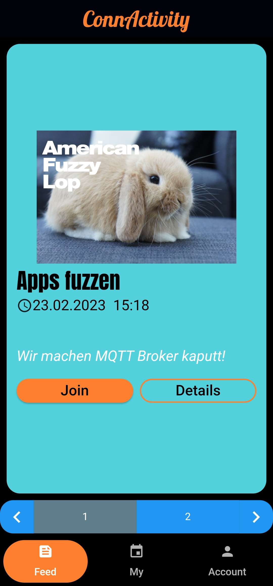
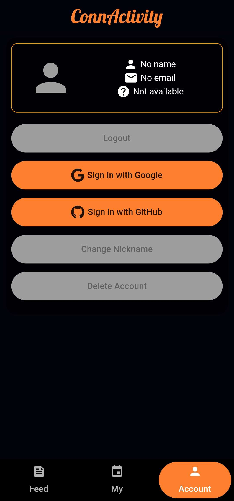

# ConnActivityMobile


## Current release
You can donwload the .apk of our first release [here](https://github.com/ConnActivity/ConnActivityMobile/releases/tag/v.1.0.0) 🎉

## What it looks like
 |  | 
:------------:|:------------:|:------------:

## Contributing
- use ```dart format```
- for testing: add own fingerprint of sign-key to project (android only) via firebase-console or use the provided debug.keystore from discord

get sha-1 and sha-256 fingerprint of default debug.keystore: ```keytool -list -v -keystore ~/.android/debug.keystore -alias androiddebugkey -storepass android -keypass android```

## Android signing
A signed .apk is available in each release. GitHub-Actions builds are not signed.
